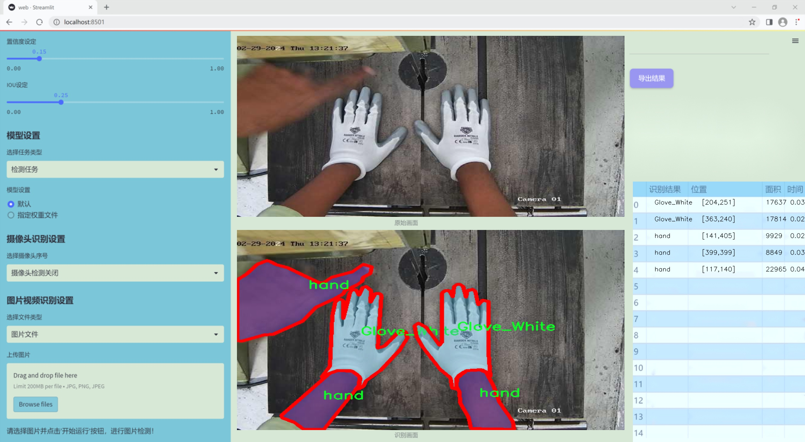
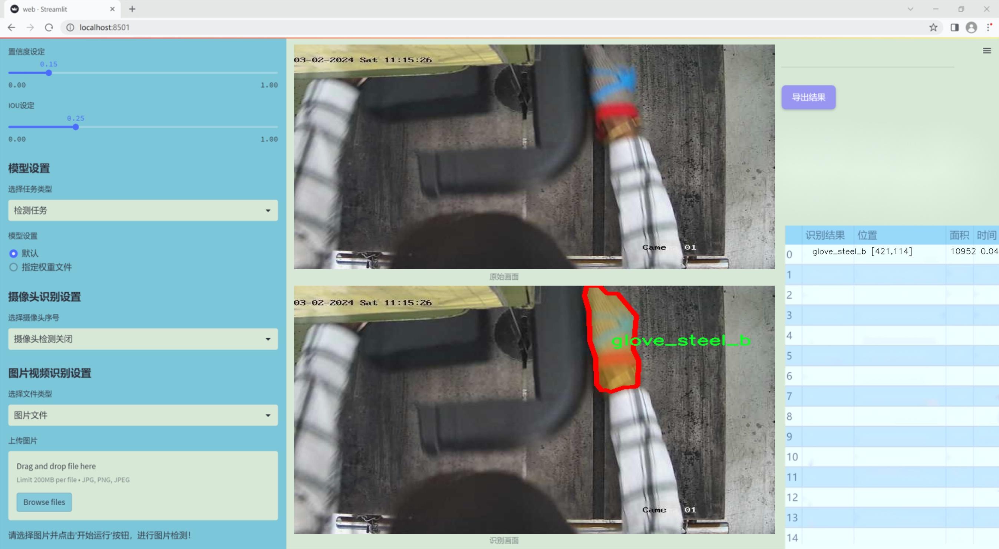
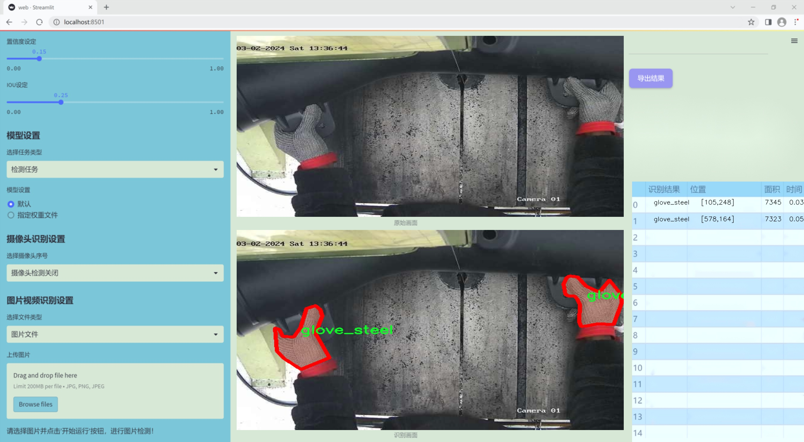
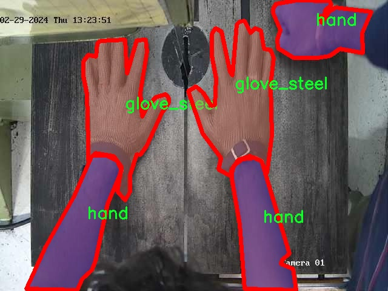
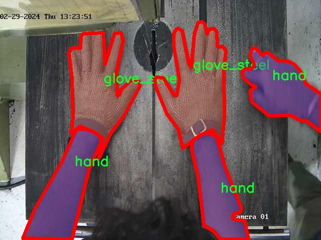
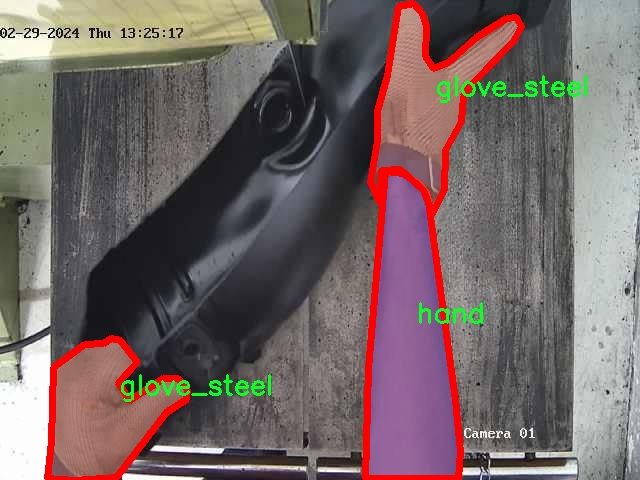
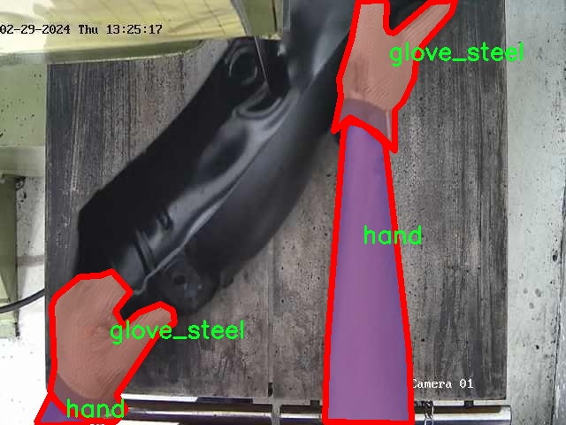
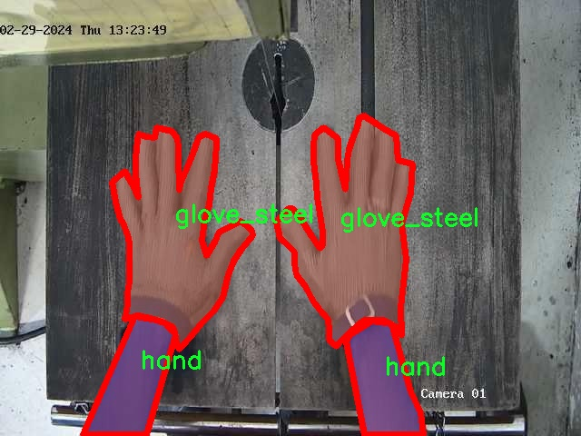

### 1.背景意义

研究背景与意义

随着工业自动化和智能制造的迅速发展，工人安全问题日益受到重视。特别是在涉及重型机械和危险操作的工作环境中，工人手部的安全保护显得尤为重要。传统的安全手套虽然在一定程度上能够保护工人的手部，但在复杂的加工操作中，如何实时监测手部的状态和安全性，成为了一个亟待解决的技术难题。因此，开发一个基于先进计算机视觉技术的手部检测系统，不仅可以提高工人的安全性，还能提升生产效率。

本研究旨在基于改进的YOLOv11模型，构建一个高效的加工操作安全手套与手部检测系统。该系统将利用包含1500张图像的bandsaw_kolabira数据集进行训练和验证。数据集中包含了多种手套和手部的类别，包括蓝色手套、白色手套、钢制手套以及手部和头部的标注信息。这些多样化的类别为模型的训练提供了丰富的样本，有助于提高模型的准确性和鲁棒性。

在实际应用中，该系统将能够实时识别工人是否佩戴安全手套，并监测手部的活动状态，从而有效预防因操作不当导致的安全事故。此外，通过对手部状态的监测，系统还可以为工人提供实时反馈，帮助其调整操作姿势，降低受伤风险。通过将计算机视觉技术与工人安全管理相结合，本研究不仅为安全生产提供了技术支持，也为未来智能制造的发展提供了新的思路和方向。

### 2.视频效果

[2.1 视频效果](https://www.bilibili.com/video/BV1joqLY6EhS/)

### 3.图片效果







##### [项目涉及的源码数据来源链接](https://kdocs.cn/l/cszuIiCKVNis)**

注意：本项目提供训练的数据集和训练教程,由于版本持续更新,暂不提供权重文件（best.pt）,请按照6.训练教程进行训练后实现上图演示的效果。

### 4.数据集信息

##### 4.1 本项目数据集类别数＆类别名

nc: 6
names: ['Glove_Blue', 'Glove_White', 'glove_steel', 'glove_steel_b', 'hand', 'head']


该项目为【图像分割】数据集，请在【训练教程和Web端加载模型教程（第三步）】这一步的时候按照【图像分割】部分的教程来训练

##### 4.2 本项目数据集信息介绍

本项目数据集信息介绍

本项目旨在改进YOLOv11的加工操作安全手套与手部检测系统，所使用的数据集围绕“bandsaw_kolabira”主题构建，专注于提升在加工环境中对手部及手套的检测能力。该数据集包含六个类别，具体为：蓝色手套（Glove_Blue）、白色手套（Glove_White）、钢制手套（glove_steel）、钢制手套B型（glove_steel_b）、手部（hand）以及头部（head）。这些类别的选择旨在全面覆盖加工操作中可能出现的关键安全元素，确保系统能够有效识别并响应不同的安全风险。

在数据集的构建过程中，采集了大量在实际加工环境中拍摄的图像，确保数据的多样性和真实性。这些图像不仅涵盖了不同的光照条件和背景环境，还包括了各种手部动作和手套佩戴状态，以增强模型的泛化能力。通过这种方式，数据集能够有效模拟真实工作场景中可能遇到的各种情况，从而为YOLOv11模型的训练提供坚实的基础。

在数据集的标注过程中，采用了精确的边界框标注技术，以确保每个类别的物体都能被准确识别。标注的质量直接影响到模型的性能，因此我们特别注重标注的一致性和准确性。此外，为了提升模型在实际应用中的表现，数据集中还包含了一些特殊情况的样本，例如手套未佩戴、佩戴不当等情形，以便模型能够在各种情况下做出正确的判断。

综上所述，本项目的数据集不仅涵盖了多样的类别和丰富的样本，还注重了标注的精确性与场景的多样性，为改进YOLOv11的加工操作安全手套与手部检测系统提供了强有力的数据支持。通过对该数据集的深入分析与应用，我们期望能够显著提升系统在实际加工环境中的安全性和有效性。











### 5.全套项目环境部署视频教程（零基础手把手教学）

[5.1 所需软件PyCharm和Anaconda安装教程（第一步）](https://www.bilibili.com/video/BV1BoC1YCEKi/?spm_id_from=333.999.0.0&vd_source=bc9aec86d164b67a7004b996143742dc)


[5.2 安装Python虚拟环境创建和依赖库安装视频教程（第二步）](https://www.bilibili.com/video/BV1ZoC1YCEBw?spm_id_from=333.788.videopod.sections&vd_source=bc9aec86d164b67a7004b996143742dc)

### 6.改进YOLOv11训练教程和Web_UI前端加载模型教程（零基础手把手教学）

[6.1 改进YOLOv11训练教程和Web_UI前端加载模型教程（第三步）](https://www.bilibili.com/video/BV1BoC1YCEhR?spm_id_from=333.788.videopod.sections&vd_source=bc9aec86d164b67a7004b996143742dc)


按照上面的训练视频教程链接加载项目提供的数据集，运行train.py即可开始训练



     Epoch   gpu_mem       box       obj       cls    labels  img_size
     1/200     20.8G   0.01576   0.01955  0.007536        22      1280: 100%|██████████| 849/849 [14:42<00:00,  1.04s/it]
               Class     Images     Labels          P          R     mAP@.5 mAP@.5:.95: 100%|██████████| 213/213 [01:14<00:00,  2.87it/s]
                 all       3395      17314      0.994      0.957      0.0957      0.0843

     Epoch   gpu_mem       box       obj       cls    labels  img_size
     2/200     20.8G   0.01578   0.01923  0.007006        22      1280: 100%|██████████| 849/849 [14:44<00:00,  1.04s/it]
               Class     Images     Labels          P          R     mAP@.5 mAP@.5:.95: 100%|██████████| 213/213 [01:12<00:00,  2.95it/s]
                 all       3395      17314      0.996      0.956      0.0957      0.0845

     Epoch   gpu_mem       box       obj       cls    labels  img_size
     3/200     20.8G   0.01561    0.0191  0.006895        27      1280: 100%|██████████| 849/849 [10:56<00:00,  1.29it/s]
               Class     Images     Labels          P          R     mAP@.5 mAP@.5:.95: 100%|███████   | 187/213 [00:52<00:00,  4.04it/s]
                 all       3395      17314      0.996      0.957      0.0957      0.0845


###### [项目数据集下载链接](https://kdocs.cn/l/cszuIiCKVNis)

### 7.原始YOLOv11算法讲解

YOLOv11是Ultralytics推出的YOLO系列最新版本，专为实现尖端的物体检测而设计。其架构和训练方法上进行了重大改进，使之不仅具备卓越的准确性和处理速度，还在计算效率上实现了一场革命。得益于其改进的主干和颈部架构，YOLOv11在特征提取和处理复杂任务时表现更加出色。在2024年9月27日，Ultralytics通过长达九小时的在线直播发布这一新作，展示了其在计算机视觉领域的革新。

YOLOv11通过精细的架构设计和优化训练流程，在保持高精度的同时，缩减了参数量，与YOLOv8m相比减少了22%的参数，使其在COCO数据集上的平均准确度（mAP）有所提升。这种效率的提高使YOLOv11非常适合部署在各种硬件环境中，包括边缘设备、云计算平台以及支持NVIDIA GPU的系统，确保在灵活性上的优势。

该模型支持广泛的任务，从对象检测、实例分割到图像分类、姿态估计和定向对象检测（OBB），几乎覆盖了计算机视觉的所有主要挑战。其创新的C3k2和C2PSA模块提升了网络深度和注意力机制的应用，提高了特征提取的效率和效果。同时，YOLOv11的改进网络结构也使之在复杂视觉任务上得以从容应对，成为各类计算机视觉任务的多功能选择。这些特性令YOLOv11在实施实时物体检测的各个领域中表现出众。
* * *

2024年9月27日，Ultralytics在线直播长达九小时，为YOLO11召开“发布会”

YOLO11 是 Ultralytics YOLO 系列实时物体检测器的最新版本，它以尖端的准确性、速度和效率重新定义了可能性。在之前 YOLO
版本的显著进步的基础上，YOLO11 在架构和训练方法方面进行了重大改进，使其成为各种计算机视觉任务的多功能选择。


##### YOLO11主要特点：

  * 增强的特征提取：YOLO11 采用了改进的主干和颈部架构，增强了特征提取能力，可实现更精确的对象检测和复杂任务性能。
  * 针对效率和速度进行了优化：YOLO11 引入了完善的架构设计和优化的训练流程，可提供更快的处理速度，并在准确度和性能之间保持最佳平衡。
  * 更少的参数，更高的准确度：借助模型设计的进步，YOLO11m 在 COCO 数据集上实现了更高的平均准确度 (mAP)，同时使用的参数比 YOLOv8m 少 22%，从而提高了计算效率，同时又不影响准确度。
  * 跨环境的适应性：YOLO11 可以无缝部署在各种环境中，包括边缘设备、云平台和支持 NVIDIA GPU 的系统，从而确保最大的灵活性。
  * 支持的任务范围广泛：无论是对象检测、实例分割、图像分类、姿势估计还是定向对象检测 (OBB)，YOLO11 都旨在满足各种计算机视觉挑战。

##### 支持的任务和模式

YOLO11 以 YOLOv8 中引入的多功能模型系列为基础，为各种计算机视觉任务提供增强的支持：

Model| Filenames| Task| Inference| Validation| Training| Export  
---|---|---|---|---|---|---  
YOLO11| yolol11n.pt, yolol11s.pt, yolol11m.pt, yolol11x.pt| Detection| ✅| ✅|
✅| ✅  
YOLO11-seg| yolol11n-seg.pt, yolol11s-seg.pt, yolol11m-seg.pt,
yolol11x-seg.pt| Instance Segmentation| ✅| ✅| ✅| ✅  
YOLO11-pose| yolol11n-pose.pt, yolol11s-pose.pt, yolol11m-pose.pt,
yolol11x-pose.pt| Pose/Keypoints| ✅| ✅| ✅| ✅  
YOLO11-obb| yolol11n-obb.pt, yolol11s-obb.pt, yolol11m-obb.pt,
yolol11x-obb.pt| Oriented Detection| ✅| ✅| ✅| ✅  
YOLO11-cls| yolol11n-cls.pt, yolol11s-cls.pt, yolol11m-cls.pt,
yolol11x-cls.pt| Classification| ✅| ✅| ✅| ✅  
  
##### 简单的 YOLO11 训练和推理示例

以下示例适用于用于对象检测的 YOLO11 Detect 模型。

    
    
    from ultralytics import YOLO
    
    # Load a model
    model = YOLO("yolo11n.pt")
    
    # Train the model
    train_results = model.train(
        data="coco8.yaml",  # path to dataset YAML
        epochs=100,  # number of training epochs
        imgsz=640,  # training image size
        device="cpu",  # device to run on, i.e. device=0 or device=0,1,2,3 or device=cpu
    )
    
    # Evaluate model performance on the validation set
    metrics = model.val()
    
    # Perform object detection on an image
    results = model("path/to/image.jpg")
    results[0].show()
    
    # Export the model to ONNX format
    path = model.export(format="onnx")  # return path to exported model

##### 支持部署于边缘设备

YOLO11 专为适应各种环境而设计，包括边缘设备。其优化的架构和高效的处理能力使其适合部署在边缘设备、云平台和支持 NVIDIA GPU
的系统上。这种灵活性确保 YOLO11 可用于各种应用，从移动设备上的实时检测到云环境中的复杂分割任务。有关部署选项的更多详细信息，请参阅导出文档。

##### YOLOv11 yaml文件

    
    
    # Ultralytics YOLO 🚀, AGPL-3.0 license
    # YOLO11 object detection model with P3-P5 outputs. For Usage examples see https://docs.ultralytics.com/tasks/detect
    
    # Parameters
    nc: 80 # number of classes
    scales: # model compound scaling constants, i.e. 'model=yolo11n.yaml' will call yolo11.yaml with scale 'n'
      # [depth, width, max_channels]
      n: [0.50, 0.25, 1024] # summary: 319 layers, 2624080 parameters, 2624064 gradients, 6.6 GFLOPs
      s: [0.50, 0.50, 1024] # summary: 319 layers, 9458752 parameters, 9458736 gradients, 21.7 GFLOPs
      m: [0.50, 1.00, 512] # summary: 409 layers, 20114688 parameters, 20114672 gradients, 68.5 GFLOPs
      l: [1.00, 1.00, 512] # summary: 631 layers, 25372160 parameters, 25372144 gradients, 87.6 GFLOPs
      x: [1.00, 1.50, 512] # summary: 631 layers, 56966176 parameters, 56966160 gradients, 196.0 GFLOPs
    
    # YOLO11n backbone
    backbone:
      # [from, repeats, module, args]
      - [-1, 1, Conv, [64, 3, 2]] # 0-P1/2
      - [-1, 1, Conv, [128, 3, 2]] # 1-P2/4
      - [-1, 2, C3k2, [256, False, 0.25]]
      - [-1, 1, Conv, [256, 3, 2]] # 3-P3/8
      - [-1, 2, C3k2, [512, False, 0.25]]
      - [-1, 1, Conv, [512, 3, 2]] # 5-P4/16
      - [-1, 2, C3k2, [512, True]]
      - [-1, 1, Conv, [1024, 3, 2]] # 7-P5/32
      - [-1, 2, C3k2, [1024, True]]
      - [-1, 1, SPPF, [1024, 5]] # 9
      - [-1, 2, C2PSA, [1024]] # 10
    
    # YOLO11n head
    head:
      - [-1, 1, nn.Upsample, [None, 2, "nearest"]]
      - [[-1, 6], 1, Concat, [1]] # cat backbone P4
      - [-1, 2, C3k2, [512, False]] # 13
    
      - [-1, 1, nn.Upsample, [None, 2, "nearest"]]
      - [[-1, 4], 1, Concat, [1]] # cat backbone P3
      - [-1, 2, C3k2, [256, False]] # 16 (P3/8-small)
    
      - [-1, 1, Conv, [256, 3, 2]]
      - [[-1, 13], 1, Concat, [1]] # cat head P4
      - [-1, 2, C3k2, [512, False]] # 19 (P4/16-medium)
    
      - [-1, 1, Conv, [512, 3, 2]]
      - [[-1, 10], 1, Concat, [1]] # cat head P5
      - [-1, 2, C3k2, [1024, True]] # 22 (P5/32-large)
    
      - [[16, 19, 22], 1, Detect, [nc]] # Detect(P3, P4, P5)
    

**YOLO11和YOLOv8 yaml文件的区别**


##### 改进模块代码

  * C3k2 

    
    
    class C3k2(C2f):
        """Faster Implementation of CSP Bottleneck with 2 convolutions."""
    
        def __init__(self, c1, c2, n=1, c3k=False, e=0.5, g=1, shortcut=True):
            """Initializes the C3k2 module, a faster CSP Bottleneck with 2 convolutions and optional C3k blocks."""
            super().__init__(c1, c2, n, shortcut, g, e)
            self.m = nn.ModuleList(
                C3k(self.c, self.c, 2, shortcut, g) if c3k else Bottleneck(self.c, self.c, shortcut, g) for _ in range(n)
            )

C3k2，它是具有两个卷积的CSP（Partial Cross Stage）瓶颈架构的更快实现。

**类继承：**

  * `C3k2`继承自类`C2f`。这表明`C2f`很可能实现了经过修改的基本CSP结构，而`C3k2`进一步优化或修改了此结构。

**构造函数（`__init__`）：**

  * `c1`：输入通道。

  * `c2`：输出通道。

  * `n`：瓶颈层数（默认为1）。

  * `c3k`：一个布尔标志，确定是否使用`C3k`块或常规`Bottleneck`块。

  * `e`：扩展比率，控制隐藏层的宽度（默认为0.5）。

  * `g`：分组卷积的组归一化参数或组数（默认值为 1）。

  * `shortcut`：一个布尔值，用于确定是否在网络中包含快捷方式连接（默认值为 `True`）。

**初始化：**

  * `super().__init__(c1, c2, n, short-cut, g, e)` 调用父类 `C2f` 的构造函数，初始化标准 CSP 组件，如通道数、快捷方式、组等。

**模块列表（`self.m`）：**

  * `nn.ModuleList` 存储 `C3k` 或 `Bottleneck` 模块，具体取决于 `c3k` 的值。

  * 如果 `c3k` 为 `True`，它会初始化 `C3k` 模块。`C3k` 模块接收以下参数：

  * `self.c`：通道数（源自 `C2f`）。

  * `2`：这表示在 `C3k` 块内使用了两个卷积层。

  * `shortcut` 和 `g`：从 `C3k2` 构造函数传递。

  * 如果 `c3k` 为 `False`，则初始化标准 `Bottleneck` 模块。

`for _ in range(n)` 表示将创建 `n` 个这样的块。

**总结：**

  * `C3k2` 实现了 CSP 瓶颈架构，可以选择使用自定义 `C3k` 块（具有两个卷积）或标准 `Bottleneck` 块，具体取决于 `c3k` 标志。

  * C2PSA

    
    
    class C2PSA(nn.Module):
        """
        C2PSA module with attention mechanism for enhanced feature extraction and processing.
    
        This module implements a convolutional block with attention mechanisms to enhance feature extraction and processing
        capabilities. It includes a series of PSABlock modules for self-attention and feed-forward operations.
    
        Attributes:
            c (int): Number of hidden channels.
            cv1 (Conv): 1x1 convolution layer to reduce the number of input channels to 2*c.
            cv2 (Conv): 1x1 convolution layer to reduce the number of output channels to c.
            m (nn.Sequential): Sequential container of PSABlock modules for attention and feed-forward operations.
    
        Methods:
            forward: Performs a forward pass through the C2PSA module, applying attention and feed-forward operations.
    
        Notes:
            This module essentially is the same as PSA module, but refactored to allow stacking more PSABlock modules.
    
        Examples:
            >>> c2psa = C2PSA(c1=256, c2=256, n=3, e=0.5)
            >>> input_tensor = torch.randn(1, 256, 64, 64)
            >>> output_tensor = c2psa(input_tensor)
        """
    
        def __init__(self, c1, c2, n=1, e=0.5):
            """Initializes the C2PSA module with specified input/output channels, number of layers, and expansion ratio."""
            super().__init__()
            assert c1 == c2
            self.c = int(c1 * e)
            self.cv1 = Conv(c1, 2 * self.c, 1, 1)
            self.cv2 = Conv(2 * self.c, c1, 1)
    
            self.m = nn.Sequential(*(PSABlock(self.c, attn_ratio=0.5, num_heads=self.c // 64) for _ in range(n)))
    
        def forward(self, x):
            """Processes the input tensor 'x' through a series of PSA blocks and returns the transformed tensor."""
            a, b = self.cv1(x).split((self.c, self.c), dim=1)
            b = self.m(b)
            return self.cv2(torch.cat((a, b), 1))

`C2PSA` 模块是一个自定义神经网络层，带有注意力机制，用于增强特征提取和处理。

**类概述**

  * **目的：**

  * `C2PSA` 模块引入了一个卷积块，利用注意力机制来改进特征提取和处理。

  * 它使用一系列 `PSABlock` 模块，这些模块可能代表某种形式的位置自注意力 (PSA)，并且该架构旨在允许堆叠多个 `PSABlock` 层。

**构造函数（`__init__`）：**

  * **参数：**

  * `c1`：输入通道（必须等于 `c2`）。

  * `c2`：输出通道（必须等于 `c1`）。

  * `n`：要堆叠的 `PSABlock` 模块数量（默认值为 1）。

  * `e`：扩展比率，用于计算隐藏通道的数量（默认值为 0.5）。

  * **属性：**

  * `self.c`：隐藏通道数，计算为 `int(c1 * e)`。

  * `self.cv1`：一个 `1x1` 卷积，将输入通道数从 `c1` 减少到 `2 * self.c`。这为将输入分成两部分做好准备。

  * `self.cv2`：另一个 `1x1` 卷积，处理后将通道维度恢复回 `c1`。

  * `self.m`：一系列 `PSABlock` 模块。每个 `PSABlock` 接收 `self.c` 通道，注意头的数量为 `self.c // 64`。每个块应用注意和前馈操作。

**前向方法：**

  * **输入：**

  * `x`，输入张量。

  * **操作：**

  1. `self.cv1(x)` 应用 `1x1` 卷积，将输入通道大小从 `c1` 减小到 `2 * self.c`。

  2. 生成的张量沿通道维度分为两部分，`a` 和 `b`。

  * `a`：第一个 `self.c` 通道。

  * `b`：剩余的 `self.c` 通道。

  1. `b` 通过顺序容器 `self.m`，它是 `PSABlock` 模块的堆栈。这部分经过基于注意的处理。

  2. 处理后的张量 `b` 与 `a` 连接。

  3. `self.cv2` 应用 `1x1` 卷积，将通道大小恢复为 `c1`。

  * **输出：**

  * 应用注意和卷积操作后的变换后的张量。

**总结：**

  * **C2PSA** 是一个增强型卷积模块，它通过堆叠的 `PSABlock` 模块应用位置自注意力。它拆分输入张量，将注意力应用于其中一部分，然后重新组合并通过最终卷积对其进行处理。此结构有助于从输入数据中提取复杂特征。

##### 网络结构


### 8.200+种全套改进YOLOV11创新点原理讲解

#### 8.1 200+种全套改进YOLOV11创新点原理讲解大全

由于篇幅限制，每个创新点的具体原理讲解就不全部展开，具体见下列网址中的改进模块对应项目的技术原理博客网址【Blog】（创新点均为模块化搭建，原理适配YOLOv5~YOLOv11等各种版本）

[改进模块技术原理博客【Blog】网址链接](https://gitee.com/qunmasj/good)


#### 8.2 精选部分改进YOLOV11创新点原理讲解

###### 这里节选部分改进创新点展开原理讲解(完整的改进原理见上图和[改进模块技术原理博客链接](https://gitee.com/qunmasj/good)【如果此小节的图加载失败可以通过CSDN或者Github搜索该博客的标题访问原始博客，原始博客图片显示正常】


### 空间和通道重建卷积SCConv
参考该博客提出的一种高效的卷积模块，称为SCConv (spatial and channel reconstruction convolution)，以减少冗余计算并促进代表性特征的学习。提出的SCConv由空间重构单元(SRU)和信道重构单元(CRU)两个单元组成。

（1）SRU根据权重分离冗余特征并进行重构，以抑制空间维度上的冗余，增强特征的表征。

（2）CRU采用分裂变换和融合策略来减少信道维度的冗余以及计算成本和存储。

（3）SCConv是一种即插即用的架构单元，可直接用于替代各种卷积神经网络中的标准卷积。实验结果表明，scconvo嵌入模型能够通过减少冗余特征来获得更好的性能，并且显著降低了复杂度和计算成本。


SCConv如图所示，它由两个单元组成，空间重建单元(SRU)和通道重建单元(CRU)，以顺序的方式放置。具体而言，对于瓶颈残差块中的中间输入特征X，首先通过SRU运算获得空间细化特征Xw，然后利用CRU运算获得信道细化特征Y。SCConv模块充分利用了特征之间的空间冗余和通道冗余，可以无缝集成到任何CNN架构中，以减少中间特征映射之间的冗余并增强CNN的特征表示。

#### SRU单元用于空间冗余


为了利用特征的空间冗余，引入了空间重构单元(SRU)，如图2所示，它利用了分离和重构操作。

分离操作 的目的是将信息丰富的特征图与空间内容对应的信息较少的特征图分离开来。我们利用组归一化(GN)层中的比例因子来评估不同特征图的信息内容。具体来说，给定一个中间特征映射X∈R N×C×H×W，首先通过减去平均值µ并除以标准差σ来标准化输入特征X，如下所示:


其中µ和σ是X的均值和标准差，ε是为了除法稳定性而加入的一个小的正常数，γ和β是可训练的仿射变换。

GN层中的可训练参数\gamma \in R^{C}用于测量每个批次和通道的空间像素方差。更丰富的空间信息反映了空间像素的更多变化，从而导致更大的γ。归一化相关权重W_{\gamma} \in R^{C}由下面公式2得到，表示不同特征映射的重要性。


然后将经Wγ重新加权的特征映射的权值通过sigmoid函数映射到(0,1)范围，并通过阈值进行门控。我们将阈值以上的权重设置为1，得到信息权重W1，将其设置为0，得到非信息权重W2(实验中阈值设置为0.5)。获取W的整个过程可以用公式表示。


最后将输入特征X分别乘以W1和W2，得到两个加权特征:信息量较大的特征X_{1}^{\omega }和信息量较小的特征X_{2}^{\omega }。这样就成功地将输入特征分为两部分:X_{1}^{\omega }具有信息量和表达性的空间内容，而X_{2}^{\omega }几乎没有信息，被认为是冗余的。

重构操作 将信息丰富的特征与信息较少的特征相加，生成信息更丰富的特征，从而节省空间空间。采用交叉重构运算，将加权后的两个不同的信息特征充分结合起来，加强它们之间的信息流。然后将交叉重构的特征X^{\omega1}和X^{\omega2}进行拼接，得到空间精细特征映射X^{\omega}。从后过程表示如下：


其中⊗是逐元素的乘法，⊕是逐元素的求和，∪是串联。将SRU应用于中间输入特征X后，不仅将信息特征与信息较少的特征分离，而且对其进行重构，增强代表性特征，抑制空间维度上的冗余特征。然而，空间精细特征映射X^{\omega}在通道维度上仍然是冗余的。

#### CRU单元用于通道冗余


分割 操作将输入的空间细化特征X^{\omega}分割成两个部分，一部分通道数是\alpha C，另一部分通道数是(1-\alpha) C，随后对两组特征的通道数使用1 * 1卷积核进行压缩，分别得到X_{up}和X_{low}。

转换 操作将输入的X_{up}作为“富特征提取”的输入，分别进行GWC和PWC，然后相加得到输出Y1，将输入X_{low}作为“富特征提取”的补充，进行PWC，得到的记过和原来的输入取并集得到Y2。

融合 操作使用简化的SKNet方法来自适应合并Y1和Y2。具体说是首先使用全局平均池化将全局空间信息和通道统计信息结合起来，得到经过池化的S1和S2。然后对S1和S2做Softmax得到特征权重向量\beta _{1}和\beta _{2}，最后使用特征权重向量得到输出Y = \beta _{1}*Y_{1} + \beta _{2}*Y_{2}，Y即为通道提炼的特征。


### 9.系统功能展示

图9.1.系统支持检测结果表格显示

  图9.2.系统支持置信度和IOU阈值手动调节

  图9.3.系统支持自定义加载权重文件best.pt(需要你通过步骤5中训练获得)

  图9.4.系统支持摄像头实时识别

  图9.5.系统支持图片识别

  图9.6.系统支持视频识别

  图9.7.系统支持识别结果文件自动保存

  图9.8.系统支持Excel导出检测结果数据


### 10. YOLOv11核心改进源码讲解

#### 10.1 VanillaNet.py

以下是对代码的核心部分进行提炼和详细注释的结果：

```python
import torch
import torch.nn as nn
import torch.nn.functional as F
from timm.layers import weight_init

# 定义激活函数类，继承自ReLU
class Activation(nn.ReLU):
    def __init__(self, dim, act_num=3, deploy=False):
        super(Activation, self).__init__()
        self.deploy = deploy  # 是否处于部署模式
        # 权重参数，形状为 (dim, 1, act_num*2 + 1, act_num*2 + 1)
        self.weight = torch.nn.Parameter(torch.randn(dim, 1, act_num*2 + 1, act_num*2 + 1))
        self.bias = None  # 偏置初始化为None
        self.bn = nn.BatchNorm2d(dim, eps=1e-6)  # 批归一化层
        self.dim = dim  # 输入维度
        self.act_num = act_num  # 激活函数数量
        weight_init.trunc_normal_(self.weight, std=.02)  # 权重初始化

    def forward(self, x):
        # 前向传播
        if self.deploy:
            # 在部署模式下，进行卷积操作
            return F.conv2d(
                super(Activation, self).forward(x), 
                self.weight, self.bias, padding=(self.act_num*2 + 1)//2, groups=self.dim)
        else:
            # 在训练模式下，先进行卷积，再进行批归一化
            return self.bn(F.conv2d(
                super(Activation, self).forward(x),
                self.weight, padding=self.act_num, groups=self.dim))

    def switch_to_deploy(self):
        # 切换到部署模式
        if not self.deploy:
            kernel, bias = self._fuse_bn_tensor(self.weight, self.bn)  # 融合权重和批归一化
            self.weight.data = kernel
            self.bias = torch.nn.Parameter(torch.zeros(self.dim))
            self.bias.data = bias
            self.__delattr__('bn')  # 删除bn属性
            self.deploy = True  # 更新状态为部署模式

    def _fuse_bn_tensor(self, weight, bn):
        # 融合卷积层权重和批归一化层的参数
        kernel = weight
        running_mean = bn.running_mean
        running_var = bn.running_var
        gamma = bn.weight
        beta = bn.bias
        eps = bn.eps
        std = (running_var + eps).sqrt()  # 计算标准差
        t = (gamma / std).reshape(-1, 1, 1, 1)  # 计算缩放因子
        return kernel * t, beta + (0 - running_mean) * gamma / std  # 返回融合后的权重和偏置

# 定义网络的基本模块
class Block(nn.Module):
    def __init__(self, dim, dim_out, act_num=3, stride=2, deploy=False):
        super().__init__()
        self.deploy = deploy
        # 根据是否部署选择不同的卷积结构
        if self.deploy:
            self.conv = nn.Conv2d(dim, dim_out, kernel_size=1)
        else:
            self.conv1 = nn.Sequential(
                nn.Conv2d(dim, dim, kernel_size=1),
                nn.BatchNorm2d(dim, eps=1e-6),
            )
            self.conv2 = nn.Sequential(
                nn.Conv2d(dim, dim_out, kernel_size=1),
                nn.BatchNorm2d(dim_out, eps=1e-6)
            )
        # 池化层的选择
        self.pool = nn.MaxPool2d(stride) if stride != 1 else nn.Identity()
        self.act = Activation(dim_out, act_num)  # 激活函数

    def forward(self, x):
        # 前向传播
        if self.deploy:
            x = self.conv(x)  # 在部署模式下直接卷积
        else:
            x = self.conv1(x)  # 训练模式下先卷积再批归一化
            x = F.leaky_relu(x, negative_slope=1)  # 使用Leaky ReLU激活
            x = self.conv2(x)  # 再次卷积

        x = self.pool(x)  # 池化
        x = self.act(x)  # 激活
        return x

# 定义主网络结构
class VanillaNet(nn.Module):
    def __init__(self, in_chans=3, num_classes=1000, dims=[96, 192, 384, 768], 
                 drop_rate=0, act_num=3, strides=[2,2,2,1], deploy=False):
        super().__init__()
        self.deploy = deploy
        # 构建stem部分
        if self.deploy:
            self.stem = nn.Sequential(
                nn.Conv2d(in_chans, dims[0], kernel_size=4, stride=4),
                Activation(dims[0], act_num)
            )
        else:
            self.stem1 = nn.Sequential(
                nn.Conv2d(in_chans, dims[0], kernel_size=4, stride=4),
                nn.BatchNorm2d(dims[0], eps=1e-6),
            )
            self.stem2 = nn.Sequential(
                nn.Conv2d(dims[0], dims[0], kernel_size=1, stride=1),
                nn.BatchNorm2d(dims[0], eps=1e-6),
                Activation(dims[0], act_num)
            )

        self.stages = nn.ModuleList()  # 存储网络的各个阶段
        for i in range(len(strides)):
            stage = Block(dim=dims[i], dim_out=dims[i+1], act_num=act_num, stride=strides[i], deploy=deploy)
            self.stages.append(stage)  # 添加阶段

    def forward(self, x):
        # 前向传播
        if self.deploy:
            x = self.stem(x)  # 部署模式下直接通过stem
        else:
            x = self.stem1(x)  # 训练模式下通过stem1
            x = F.leaky_relu(x, negative_slope=1)  # 激活
            x = self.stem2(x)  # 通过stem2

        for stage in self.stages:
            x = stage(x)  # 通过每个阶段
        return x

    def switch_to_deploy(self):
        # 切换到部署模式
        if not self.deploy:
            # 融合stem1和stem2的参数
            kernel, bias = self._fuse_bn_tensor(self.stem1[0], self.stem1[1])
            self.stem1[0].weight.data = kernel
            self.stem1[0].bias.data = bias
            self.stem = nn.Sequential(self.stem1[0], self.stem2[2])  # 更新stem
            for stage in self.stages:
                stage.switch_to_deploy()  # 更新每个阶段
            self.deploy = True  # 更新状态为部署模式

def update_weight(model_dict, weight_dict):
    # 更新模型权重
    temp_dict = {}
    for k, v in weight_dict.items():
        if k in model_dict.keys() and model_dict[k].shape == v.shape:
            temp_dict[k] = v
    model_dict.update(temp_dict)  # 更新权重
    return model_dict

# 定义不同版本的VanillaNet
def vanillanet_5(pretrained='', **kwargs):
    model = VanillaNet(dims=[128*4, 256*4, 512*4, 1024*4], strides=[2,2,2], **kwargs)
    if pretrained:
        weights = torch.load(pretrained)['model_ema']
        model.load_state_dict(update_weight(model.state_dict(), weights))
    return model

# 其他版本类似...

if __name__ == '__main__':
    inputs = torch.randn((1, 3, 640, 640))  # 输入数据
    model = vanillanet_10()  # 创建模型
    pred = model(inputs)  # 前向传播
    for i in pred:
        print(i.size())  # 输出每层的尺寸
```

### 代码分析
1. **Activation类**：自定义的激活函数类，继承自ReLU，支持批归一化和权重融合。
2. **Block类**：构建网络的基本模块，包含卷积层、池化层和激活函数。
3. **VanillaNet类**：主网络结构，包含多个Block，支持不同的输入通道和输出维度。
4. **权重更新函数**：用于加载预训练模型的权重，并更新当前模型的权重。
5. **不同版本的VanillaNet**：提供了多种不同配置的VanillaNet模型创建函数。

### 总结
该代码实现了一个灵活的卷积神经网络架构，支持多种配置和预训练权重加载，适用于图像分类等任务。

这个文件是一个实现了VanillaNet模型的PyTorch代码，主要用于图像分类等计算机视觉任务。代码的结构包括模型的定义、各个组件的实现以及不同版本的VanillaNet的构建函数。

首先，文件中引入了必要的库，包括PyTorch及其神经网络模块、一些功能性模块以及NumPy。接着，定义了一个名为`activation`的类，它继承自`nn.ReLU`，用于实现自定义的激活函数。这个类在初始化时会创建一个权重参数和一个批归一化层，并在前向传播中根据是否处于部署模式（`deploy`）来选择不同的计算方式。`switch_to_deploy`方法用于将模型切换到部署模式，融合批归一化的权重。

接下来是`Block`类的定义，它是VanillaNet的基本构建块。每个Block包含两个卷积层和一个激活层，可能还会有池化层。根据`deploy`参数的不同，Block会选择不同的前向传播方式。`switch_to_deploy`方法同样用于将Block切换到部署模式。

`VanillaNet`类是整个模型的核心，包含了多个Block和一个初始卷积层（stem）。在初始化时，模型会根据输入通道数、类别数、各层的维度、步幅等参数来构建网络结构。`forward`方法定义了数据的前向传播过程，返回不同尺度的特征图。

此外，文件中还定义了一些辅助函数，比如`update_weight`用于更新模型的权重，`vanillanet_x`系列函数用于创建不同版本的VanillaNet模型，并支持加载预训练权重。

最后，在`__main__`部分，代码创建了一个输入张量并实例化了一个VanillaNet模型，然后通过模型进行前向传播并打印输出特征图的尺寸。

整体来看，这个文件实现了一个灵活且可扩展的神经网络模型，适用于各种计算机视觉任务，并且提供了方便的预训练权重加载功能。

#### 10.2 test_selective_scan_speed.py

以下是经过简化和注释的核心代码部分，主要集中在 `build_selective_scan_fn` 函数及其内部的 `SelectiveScanFn` 类上。该代码实现了一个选择性扫描（Selective Scan）操作的前向和反向传播功能。

```python
import torch
import torch.nn.functional as F

def build_selective_scan_fn(selective_scan_cuda: object = None, mode="mamba_ssm", tag=None):
    """
    构建选择性扫描函数。
    
    参数:
    selective_scan_cuda: 用于CUDA实现的选择性扫描函数。
    mode: 模式选择，用于不同的选择性扫描实现。
    tag: 标签，用于标识函数。
    
    返回:
    selective_scan_fn: 选择性扫描函数。
    """
    
    class SelectiveScanFn(torch.autograd.Function):
        @staticmethod
        def forward(ctx, u, delta, A, B, C, D=None, z=None, delta_bias=None, delta_softplus=False, return_last_state=False, nrows=1, backnrows=-1):
            """
            前向传播函数。
            
            参数:
            ctx: 上下文对象，用于保存状态。
            u, delta, A, B, C, D, z: 输入张量。
            delta_bias: 偏置项。
            delta_softplus: 是否使用softplus。
            return_last_state: 是否返回最后状态。
            nrows, backnrows: 行数参数。
            
            返回:
            out: 输出张量。
            last_state: 最后状态（可选）。
            """
            # 确保输入张量是连续的
            u = u.contiguous() if u.stride(-1) != 1 else u
            delta = delta.contiguous() if delta.stride(-1) != 1 else delta
            if D is not None:
                D = D.contiguous()
            B = B.contiguous() if B.stride(-1) != 1 else B
            C = C.contiguous() if C.stride(-1) != 1 else C
            if z is not None and z.stride(-1) != 1:
                z = z.contiguous()

            # 处理输入张量的维度
            if B.dim() == 3:
                B = rearrange(B, "b dstate l -> b 1 dstate l")
                ctx.squeeze_B = True
            if C.dim() == 3:
                C = rearrange(C, "b dstate l -> b 1 dstate l")
                ctx.squeeze_C = True

            # 检查输入的形状和维度
            assert u.shape[1] % (B.shape[1] * nrows) == 0 
            assert nrows in [1, 2, 3, 4]

            if backnrows > 0:
                assert u.shape[1] % (B.shape[1] * backnrows) == 0 
                assert backnrows in [1, 2, 3, 4]
            else:
                backnrows = nrows
            ctx.backnrows = backnrows
            
            # 调用CUDA实现的前向函数
            if mode == "mamba_ssm":
                out, x, *rest = selective_scan_cuda.fwd(u, delta, A, B, C, D, z, delta_bias, delta_softplus)
            else:
                raise NotImplementedError

            ctx.delta_softplus = delta_softplus
            ctx.has_z = z is not None

            last_state = x[:, :, -1, 1::2]  # 获取最后状态
            ctx.save_for_backward(u, delta, A, B, C, D, delta_bias, x)
            return out if not return_last_state else (out, last_state)

        @staticmethod
        def backward(ctx, dout):
            """
            反向传播函数。
            
            参数:
            ctx: 上下文对象，包含前向传播中保存的状态。
            dout: 上游梯度。
            
            返回:
            du, ddelta, dA, dB, dC, dD, dz, ddelta_bias: 各个输入的梯度。
            """
            u, delta, A, B, C, D, delta_bias, x = ctx.saved_tensors
            dout = dout.contiguous() if dout.stride(-1) != 1 else dout
            
            # 调用CUDA实现的反向函数
            du, ddelta, dA, dB, dC, dD, ddelta_bias, *rest = selective_scan_cuda.bwd(
                u, delta, A, B, C, D, delta_bias, dout, x, ctx.delta_softplus, ctx.backnrows
            )

            # 返回各个输入的梯度
            return (du, ddelta, dA, dB, dC, dD if D is not None else None, None, ddelta_bias if delta_bias is not None else None)

    def selective_scan_fn(u, delta, A, B, C, D=None, z=None, delta_bias=None, delta_softplus=False, return_last_state=False, nrows=1, backnrows=-1):
        """
        选择性扫描函数的封装。
        """
        return SelectiveScanFn.apply(u, delta, A, B, C, D, z, delta_bias, delta_softplus, return_last_state, nrows, backnrows)

    return selective_scan_fn
```

### 代码注释说明：
1. **build_selective_scan_fn**: 该函数用于构建选择性扫描的前向和反向传播函数，接受CUDA实现和模式作为参数。
2. **SelectiveScanFn**: 这是一个自定义的PyTorch函数，包含前向和反向传播的实现。
   - **forward**: 处理输入张量，检查形状和维度，调用CUDA实现的前向函数，并返回输出和最后状态（如果需要）。
   - **backward**: 计算梯度，调用CUDA实现的反向函数，并返回各个输入的梯度。
3. **selective_scan_fn**: 封装了`SelectiveScanFn`的调用，简化了用户的接口。

这个简化的代码部分保留了核心功能，同时提供了详细的中文注释，帮助理解每个部分的作用。

这个程序文件 `test_selective_scan_speed.py` 主要用于测试和比较不同选择性扫描（selective scan）算法的速度。文件中包含了多个函数和类，主要是用 PyTorch 实现的自定义前向和反向传播操作。以下是对文件中代码的逐步讲解。

首先，文件导入了一些必要的库，包括 `torch` 和 `pytest`，以及一些用于处理张量的工具，如 `einops` 和 `functools`。这些库为后续的计算提供了基础。

接下来，定义了一个 `build_selective_scan_fn` 函数，该函数用于构建选择性扫描的自定义函数。它内部定义了一个 `SelectiveScanFn` 类，继承自 `torch.autograd.Function`，这个类实现了前向传播和反向传播的逻辑。

在 `SelectiveScanFn` 类中，`forward` 方法负责处理输入数据并执行选择性扫描的前向计算。它首先确保输入张量是连续的，并根据输入的维度调整张量的形状。然后，根据不同的模式（如 "mamba_ssm"、"sscore" 等），调用相应的 CUDA 后端函数进行计算。计算结果包括输出张量和中间状态，最后将必要的张量保存到上下文中，以便在反向传播时使用。

`backward` 方法实现了反向传播的逻辑，计算梯度并返回。它根据前向传播时的上下文信息，调用相应的 CUDA 后端函数来计算梯度。

接着，定义了 `selective_scan_ref` 函数，这是一个参考实现，用于执行选择性扫描的计算。它的实现逻辑与 `SelectiveScanFn` 类似，但使用的是纯 Python 和 PyTorch 的张量操作，适合用于验证和比较性能。

随后，定义了 `selective_scan_easy` 和 `selective_scan_easy_v2` 函数，这两个函数实现了选择性扫描的简化版本，主要用于处理输入数据并返回计算结果。

文件的最后部分是 `test_speed` 函数，它用于测试不同选择性扫描实现的速度。函数首先设置了一些参数，包括数据类型、序列长度、批量大小等。然后生成随机输入数据，并使用不同的选择性扫描实现进行前向和反向计算，记录每种实现的执行时间。

在测试过程中，使用 `torch.no_grad()` 来避免计算梯度，以便只测量前向传播的时间。使用 `torch.cuda.synchronize()` 确保所有 CUDA 操作完成后再记录时间。

最后，测试结果会打印到控制台，显示每种实现的前向和前向反向传播的耗时。

整体而言，这个程序文件的目的是通过不同的实现来比较选择性扫描算法的性能，帮助开发者选择最优的实现方案。

#### 10.3 fadc.py

以下是代码中最核心的部分，并附上详细的中文注释：

```python
import torch
import torch.nn as nn
import torch.nn.functional as F

class OmniAttention(nn.Module):
    def __init__(self, in_planes, out_planes, kernel_size, groups=1, reduction=0.0625, kernel_num=4, min_channel=16):
        super(OmniAttention, self).__init__()
        # 计算注意力通道数
        attention_channel = max(int(in_planes * reduction), min_channel)
        self.kernel_size = kernel_size
        self.kernel_num = kernel_num
        self.temperature = 1.0  # 温度参数，用于调整注意力分布

        # 定义各个层
        self.avgpool = nn.AdaptiveAvgPool2d(1)  # 自适应平均池化
        self.fc = nn.Conv2d(in_planes, attention_channel, 1, bias=False)  # 全连接层
        self.bn = nn.BatchNorm2d(attention_channel)  # 批归一化
        self.relu = nn.ReLU(inplace=True)  # ReLU激活函数

        # 定义通道注意力
        self.channel_fc = nn.Conv2d(attention_channel, in_planes, 1, bias=True)
        self.func_channel = self.get_channel_attention

        # 定义滤波器注意力
        if in_planes == groups and in_planes == out_planes:  # 深度卷积
            self.func_filter = self.skip
        else:
            self.filter_fc = nn.Conv2d(attention_channel, out_planes, 1, bias=True)
            self.func_filter = self.get_filter_attention

        # 定义空间注意力
        if kernel_size == 1:  # 点卷积
            self.func_spatial = self.skip
        else:
            self.spatial_fc = nn.Conv2d(attention_channel, kernel_size * kernel_size, 1, bias=True)
            self.func_spatial = self.get_spatial_attention

        # 定义核注意力
        if kernel_num == 1:
            self.func_kernel = self.skip
        else:
            self.kernel_fc = nn.Conv2d(attention_channel, kernel_num, 1, bias=True)
            self.func_kernel = self.get_kernel_attention

        self._initialize_weights()  # 初始化权重

    def _initialize_weights(self):
        # 初始化卷积层和批归一化层的权重
        for m in self.modules():
            if isinstance(m, nn.Conv2d):
                nn.init.kaiming_normal_(m.weight, mode='fan_out', nonlinearity='relu')
                if m.bias is not None:
                    nn.init.constant_(m.bias, 0)
            if isinstance(m, nn.BatchNorm2d):
                nn.init.constant_(m.weight, 1)
                nn.init.constant_(m.bias, 0)

    @staticmethod
    def skip(_):
        return 1.0  # 跳过操作，返回1.0

    def get_channel_attention(self, x):
        # 计算通道注意力
        channel_attention = torch.sigmoid(self.channel_fc(x).view(x.size(0), -1, 1, 1) / self.temperature)
        return channel_attention

    def get_filter_attention(self, x):
        # 计算滤波器注意力
        filter_attention = torch.sigmoid(self.filter_fc(x).view(x.size(0), -1, 1, 1) / self.temperature)
        return filter_attention

    def get_spatial_attention(self, x):
        # 计算空间注意力
        spatial_attention = self.spatial_fc(x).view(x.size(0), 1, 1, 1, self.kernel_size, self.kernel_size)
        spatial_attention = torch.sigmoid(spatial_attention / self.temperature)
        return spatial_attention

    def get_kernel_attention(self, x):
        # 计算核注意力
        kernel_attention = self.kernel_fc(x).view(x.size(0), -1, 1, 1, 1, 1)
        kernel_attention = F.softmax(kernel_attention / self.temperature, dim=1)
        return kernel_attention

    def forward(self, x):
        # 前向传播
        x = self.avgpool(x)  # 自适应平均池化
        x = self.fc(x)  # 全连接层
        x = self.bn(x)  # 批归一化
        x = self.relu(x)  # ReLU激活
        return self.func_channel(x), self.func_filter(x), self.func_spatial(x), self.func_kernel(x)  # 返回各个注意力

# 生成拉普拉斯金字塔的函数
def generate_laplacian_pyramid(input_tensor, num_levels, size_align=True, mode='bilinear'):
    pyramid = []  # 存储金字塔层
    current_tensor = input_tensor  # 当前张量
    _, _, H, W = current_tensor.shape  # 获取输入张量的形状
    for _ in range(num_levels):
        b, _, h, w = current_tensor.shape  # 获取当前张量的形状
        # 下采样
        downsampled_tensor = F.interpolate(current_tensor, (h//2 + h%2, w//2 + w%2), mode=mode, align_corners=(H%2) == 1)
        if size_align: 
            # 对齐大小
            upsampled_tensor = F.interpolate(downsampled_tensor, (H, W), mode=mode, align_corners=(H%2) == 1)
            laplacian = F.interpolate(current_tensor, (H, W), mode=mode, align_corners=(H%2) == 1) - upsampled_tensor
        else:
            upsampled_tensor = F.interpolate(downsampled_tensor, (h, w), mode=mode, align_corners=(H%2) == 1)
            laplacian = current_tensor - upsampled_tensor
        pyramid.append(laplacian)  # 添加拉普拉斯层
        current_tensor = downsampled_tensor  # 更新当前张量
    if size_align: 
        current_tensor = F.interpolate(current_tensor, (H, W), mode=mode, align_corners=(H%2) == 1)
    pyramid.append(current_tensor)  # 添加最后一层
    return pyramid  # 返回金字塔

class AdaptiveDilatedConv(nn.Module):
    """自适应膨胀卷积的封装类"""
    def __init__(self, in_channels, out_channels, kernel_size, stride=1, padding=0, dilation=1, groups=1, bias=True):
        super(AdaptiveDilatedConv, self).__init__()
        # 定义卷积层
        self.conv = nn.Conv2d(in_channels, out_channels, kernel_size, stride=stride, padding=padding, dilation=dilation, groups=groups, bias=bias)
        self.omni_attention = OmniAttention(in_channels, out_channels, kernel_size)  # 实例化OmniAttention

    def forward(self, x):
        # 前向传播
        attention_weights = self.omni_attention(x)  # 计算注意力权重
        x = self.conv(x)  # 卷积操作
        return x * attention_weights  # 返回加权后的输出
```

### 代码核心部分说明：
1. **OmniAttention 类**：实现了多种注意力机制，包括通道注意力、滤波器注意力、空间注意力和核注意力。通过这些注意力机制，可以动态调整特征图的不同部分的权重，从而提高模型的表现。

2. **generate_laplacian_pyramid 函数**：用于生成拉普拉斯金字塔，主要用于图像处理中的多尺度特征提取。通过逐层下采样和上采样，可以提取不同尺度的特征。

3. **AdaptiveDilatedConv 类**：实现了自适应膨胀卷积，结合了卷积操作和注意力机制。通过注意力机制，能够动态调整卷积操作的权重，从而增强模型的表达能力。

这些核心部分共同构成了一个强大的卷积神经网络架构，能够在图像处理和计算机视觉任务中取得良好的效果。

这个程序文件 `fadc.py` 是一个基于 PyTorch 的深度学习模型实现，主要涉及自适应膨胀卷积和频率选择机制。文件中包含多个类和函数，以下是对主要部分的讲解。

首先，文件导入了必要的库，包括 PyTorch 的核心库和一些常用的模块。然后，定义了一个名为 `OmniAttention` 的类，它是一个自定义的注意力机制。这个类的构造函数接收多个参数，包括输入和输出通道数、卷积核大小、组数、缩减比例等。它通过多个卷积层和激活函数来计算通道注意力、过滤器注意力、空间注意力和卷积核注意力。`forward` 方法将输入张量通过一系列操作生成注意力权重，这些权重可以在后续的卷积操作中使用。

接下来，定义了一个名为 `generate_laplacian_pyramid` 的函数，用于生成拉普拉斯金字塔。该函数通过逐层下采样输入张量，并计算当前层与下采样后的张量之间的差异，构建金字塔结构。此函数的输出是一个包含多个层次的金字塔列表，通常用于图像处理和特征提取。

然后，定义了 `FrequencySelection` 类，它用于选择特定频率的特征。该类支持多种操作模式，包括平均池化和拉普拉斯金字塔。构造函数中根据输入参数初始化多个卷积层和频率选择机制。`forward` 方法根据选择的频率对输入特征进行处理，并返回加权后的特征。

接下来是 `AdaptiveDilatedConv` 类，它是一个自适应膨胀卷积的实现，继承自 `ModulatedDeformConv2d`。该类的构造函数中定义了多个参数，包括卷积类型、偏移频率、卷积核分解等。它的 `forward` 方法实现了自适应卷积操作，结合了注意力机制和频率选择。

最后，定义了 `AdaptiveDilatedDWConv` 类，它是一个适应性膨胀深度卷积的实现。与前一个类类似，它也包含多个卷积层和注意力机制，并在 `forward` 方法中实现了深度卷积的操作。

整体来看，这个文件实现了一个复杂的卷积神经网络结构，结合了自适应卷积、注意力机制和频率选择，适用于图像处理和特征提取等任务。代码中使用了大量的 PyTorch API，展示了深度学习模型的灵活性和可扩展性。

#### 10.4 dyhead_prune.py

以下是保留的核心代码部分，并附上详细的中文注释：

```python
import torch
import torch.nn as nn
import torch.nn.functional as F

class DyReLU(nn.Module):
    """动态ReLU激活函数模块，具有自适应的激活强度和偏置。"""
    def __init__(self, inp, reduction=4, lambda_a=1.0, use_bias=True):
        super(DyReLU, self).__init__()
        self.oup = inp  # 输出通道数
        self.lambda_a = lambda_a * 2  # 激活强度的缩放因子
        self.avg_pool = nn.AdaptiveAvgPool2d(1)  # 自适应平均池化层

        # 根据输入通道数和缩减比例计算squeeze通道数
        squeeze = inp // reduction
        self.fc = nn.Sequential(
            nn.Linear(inp, squeeze),  # 全连接层，输入为inp，输出为squeeze
            nn.ReLU(inplace=True),  # ReLU激活函数
            nn.Linear(squeeze, self.oup * 2),  # 输出为两倍的输出通道数
            h_sigmoid()  # 使用h_sigmoid激活函数
        )

    def forward(self, x):
        """前向传播函数，计算动态激活值。"""
        b, c, h, w = x.size()  # 获取输入的批量大小、通道数、高度和宽度
        y = self.avg_pool(x).view(b, c)  # 对输入进行自适应平均池化并调整形状
        y = self.fc(y).view(b, self.oup * 2, 1, 1)  # 通过全连接层并调整形状

        # 从y中分离出两个激活强度和偏置
        a1, b1 = torch.split(y, self.oup, dim=1)
        a1 = (a1 - 0.5) * self.lambda_a + 1.0  # 计算动态激活强度
        out = x * a1 + b1  # 计算输出

        return out  # 返回动态激活后的输出

class DyDCNv2(nn.Module):
    """带有归一化层的ModulatedDeformConv2d模块。"""
    def __init__(self, in_channels, out_channels, stride=1, norm_cfg=dict(type='GN', num_groups=16)):
        super().__init__()
        self.conv = ModulatedDeformConv2d(in_channels, out_channels, 3, stride=stride, padding=1)  # 定义可调变形卷积层
        self.norm = build_norm_layer(norm_cfg, out_channels)[1] if norm_cfg else None  # 根据配置构建归一化层

    def forward(self, x, offset, mask):
        """前向传播函数，计算卷积输出。"""
        x = self.conv(x.contiguous(), offset, mask)  # 进行卷积操作
        if self.norm:
            x = self.norm(x)  # 如果有归一化层，则进行归一化
        return x  # 返回卷积后的输出

class DyHeadBlock_Prune(nn.Module):
    """包含三种注意力机制的DyHead模块。"""
    def __init__(self, in_channels, norm_type='GN'):
        super().__init__()
        self.spatial_conv_high = DyDCNv2(in_channels, in_channels)  # 高层特征卷积
        self.spatial_conv_mid = DyDCNv2(in_channels, in_channels)  # 中层特征卷积
        self.spatial_conv_low = DyDCNv2(in_channels, in_channels, stride=2)  # 低层特征卷积
        self.spatial_conv_offset = nn.Conv2d(in_channels, 27, 3, padding=1)  # 计算偏移和掩码的卷积层
        self.task_attn_module = DyReLU(in_channels)  # 任务注意力模块

    def forward(self, x, level):
        """前向传播函数，计算不同层次特征的融合。"""
        offset_and_mask = self.spatial_conv_offset(x[level])  # 计算偏移和掩码
        offset = offset_and_mask[:, :18, :, :]  # 提取偏移
        mask = offset_and_mask[:, 18:, :, :].sigmoid()  # 提取掩码并应用sigmoid

        mid_feat = self.spatial_conv_mid(x[level], offset, mask)  # 中层特征卷积
        sum_feat = mid_feat  # 初始化特征和

        # 如果有低层特征，则进行卷积并加权
        if level > 0:
            low_feat = self.spatial_conv_low(x[level - 1], offset, mask)
            sum_feat += low_feat

        # 如果有高层特征，则进行卷积并加权
        if level < len(x) - 1:
            high_feat = F.interpolate(self.spatial_conv_high(x[level + 1], offset, mask), size=x[level].shape[-2:], mode='bilinear', align_corners=True)
            sum_feat += high_feat

        return self.task_attn_module(sum_feat)  # 返回经过任务注意力模块处理的特征
```

### 代码核心部分说明：
1. **DyReLU**：实现了动态ReLU激活函数，可以根据输入自适应调整激活强度和偏置。
2. **DyDCNv2**：实现了带有归一化层的可调变形卷积，能够根据输入特征计算偏移和掩码。
3. **DyHeadBlock_Prune**：集成了多个卷积层和注意力机制，能够处理不同层次的特征并进行融合，最终输出经过注意力机制加权的特征。

这个程序文件 `dyhead_prune.py` 是一个基于 PyTorch 的深度学习模块，主要用于实现动态头部（Dynamic Head）中的一些自定义激活函数和卷积操作。文件中定义了多个类，每个类实现了特定的功能，以下是对代码的详细讲解。

首先，文件导入了必要的库，包括 PyTorch 的核心库和一些功能模块，如卷积、激活函数等。它还尝试从 `mmcv` 和 `mmengine` 导入一些功能，如果导入失败则捕获异常。

接下来，定义了一个 `_make_divisible` 函数，用于确保某个值可以被指定的除数整除，并且在必要时对其进行调整，以避免过大的变化。

然后，定义了几个自定义的激活函数类，包括 `swish`、`h_swish` 和 `h_sigmoid`。这些类继承自 `nn.Module`，并实现了 `forward` 方法，定义了它们各自的前向传播逻辑。

`DyReLU` 类是一个动态激活函数，具有可调的参数和可选的空间注意力机制。它的构造函数接受多个参数，包括输入通道数、缩减比例、初始化参数等。`forward` 方法中根据输入的特征图计算动态激活值，并根据条件选择不同的输出方式。

`DyDCNv2` 类是一个封装了调制变形卷积（Modulated Deformable Convolution）的模块，支持可选的归一化层。它的构造函数接受输入和输出通道数、步幅以及归一化配置，并在前向传播中执行卷积操作。

`DyHeadBlock_Prune` 类是动态头部的主要模块，包含了多个卷积层和注意力机制。它的构造函数初始化了多个卷积层和注意力模块，并定义了权重初始化的方法。`forward` 方法计算输入特征图的偏移量和掩码，并通过不同的卷积层处理特征图，最终结合不同层次的特征进行输出。

整个文件的结构清晰，功能模块化，适合在深度学习模型中使用，尤其是在需要动态调整特征图的情况下。通过这些自定义的激活函数和卷积操作，可以实现更灵活的特征提取和表示学习。

### 11.完整训练+Web前端界面+200+种全套创新点源码、数据集获取


# [下载链接：https://mbd.pub/o/bread/Z5yYk55v](https://mbd.pub/o/bread/Z5yYk55v)